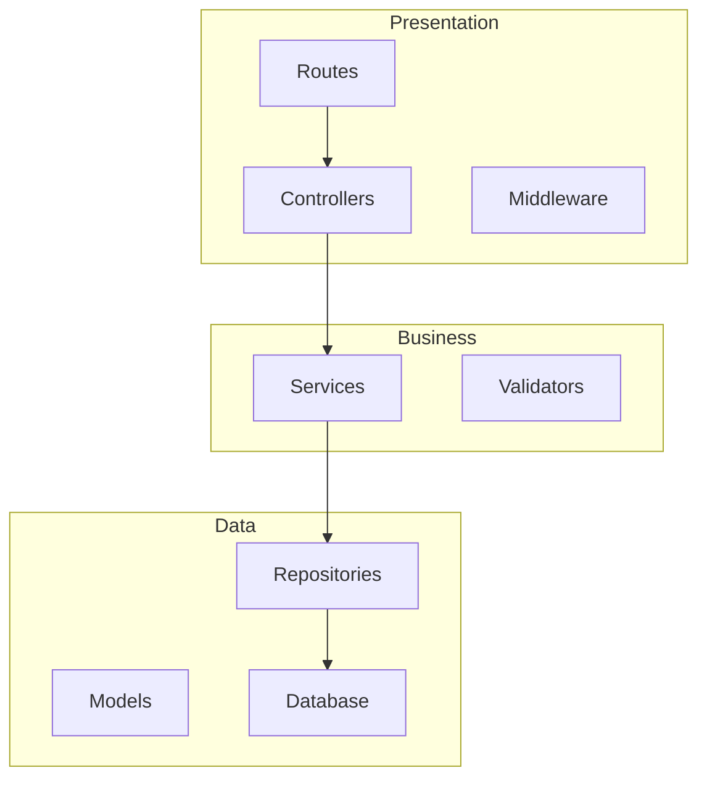
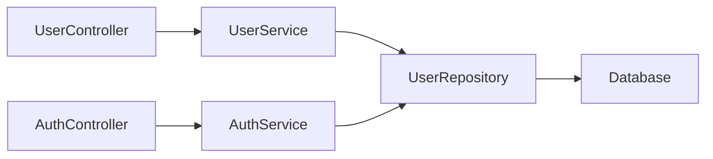

# Update Architecture - Auto-Generate/Update Architecture Documentation

Automatically analyze project structure and generate/update comprehensive architecture documentation with Mermaid diagrams.

$ARGUMENTS (optional: specific component or "all" for full regeneration)

---

## What This Does

Scans your project and generates/updates:
- `.claude/architecture/overview.md` - System architecture with diagrams
- `.claude/architecture/components.md` - Component catalog
- `.claude/architecture/data-flow.md` - Data flow diagrams
- `.claude/architecture/decisions.md` - Architectural Decision Records

---

## Usage

```bash
# Generate/update all architecture docs
/update-architecture

# Regenerate everything from scratch
/update-architecture all

# Update specific section
/update-architecture overview
```

---

## Workflow

### Phase 1: Project Analysis

1. **Detect Project Type**
   - Scan for package managers (package.json, requirements.txt, go.mod, Gemfile)
   - Identify language and framework
   - Detect architecture pattern (MVC, Clean Architecture, Layered, etc.)

2. **Scan Structure**
   - Find key directories: controllers, services, models, repositories, middleware
   - Identify entry points: main.js, app.py, main.go
   - Locate configuration files

3. **Extract Components**
   - List all controllers, services, models
   - Map component relationships
   - Identify data flow patterns

### Phase 2: Documentation Generation

**Auto-launch `doc-updater` agent:**

```javascript
Task({
  subagent_type: "doc-updater",
  description: "Generate architecture documentation",
  prompt: `Analyze project structure and generate comprehensive architecture documentation.

Project: ${project_path}
Language/Framework: ${detected_stack}
Architecture Pattern: ${detected_pattern}

Generate documentation in .claude/architecture/:

1. **overview.md** - System Architecture
   - Architecture pattern (MVC, Clean, Layered, Microservices)
   - System diagram (Mermaid)
   - Layer descriptions (Presentation, Business, Data)
   - Key components list
   - Data flow diagram (Mermaid sequence)
   - Folder structure with explanations
   - Design patterns used
   - Technology stack
   - Architectural decisions and trade-offs

2. **components.md** - Component Catalog
   - Controllers: responsibility, location
   - Services: responsibility, dependencies
   - Models/Repositories: data access patterns
   - Middleware: cross-cutting concerns
   - Utilities: shared functionality
   - Component dependency graph (Mermaid)

3. **data-flow.md** - Data Flow Patterns
   - Request/response flow (Mermaid sequence diagrams)
   - Authentication flow
   - Data validation flow
   - Error handling flow
   - Database transaction flow

4. **decisions.md** - Architectural Decision Records (ADRs)
   - Why this architecture pattern?
   - Why this folder structure?
   - Key trade-offs and constraints
   - Future considerations

Requirements:
- Use Mermaid for all diagrams
- Keep each file < 500 lines
- Be concise but complete
- Include file paths and line numbers
- Explain "why" not just "what"
- Use tables for structured data

Output location: .claude/architecture/`
})
```

### Phase 3: Verification

1. **Check Generated Files**
   - Verify all files created
   - Check Mermaid syntax validity
   - Ensure completeness

2. **Report Results**
   ```markdown
   ## Architecture Documentation Updated

   **Generated:**
   - ✅ .claude/architecture/overview.md (${line_count} lines)
   - ✅ .claude/architecture/components.md (${component_count} components)
   - ✅ .claude/architecture/data-flow.md (${diagram_count} diagrams)
   - ✅ .claude/architecture/decisions.md (${decision_count} ADRs)

   **Architecture Pattern:** ${pattern}
   **Technology Stack:** ${stack}
   **Components Found:** ${total_components}

   **Next Steps:**
   - Review generated documentation
   - Run /update-database to document database schema
   - Update CLAUDE.md to reference architecture docs
   ```

---

## What Gets Generated

### overview.md

```markdown
# Architecture Overview

## Architecture Pattern
Model-View-Controller (MVC)

## System Diagram


## Layers
[Detailed layer descriptions]

## Components
[Component catalog]

## Data Flow
[Mermaid sequence diagrams]

## Technology Stack
[Stack details]
```

### components.md

```markdown
# Component Catalog

## Controllers
| Component | Responsibility | Dependencies | Location |
|-----------|----------------|--------------|----------|
| UserController | User CRUD | UserService | src/controllers/user.ts |
| AuthController | Authentication | AuthService | src/controllers/auth.ts |

## Component Dependency Graph


[More sections...]
```

---

## Auto-Launch Conditions

This command automatically triggers when:
- SessionStart: Architecture docs missing
- User requests: "Document architecture"
- User runs: `/update-docs`
- Keywords: "アーキテクチャ更新", "構造ドキュメント"

---

## Integration

### With `/plan` Command
- Load architecture docs before planning
- Ensure new features align with architecture

### With `/document` Command
- Architecture docs inform user documentation
- Consistent terminology

### With CLAUDE.md
```markdown
## Architecture

See `.claude/architecture/overview.md` for full system architecture.
Quick: [MVC pattern, Express + PostgreSQL]

To load: `/architecture` or read .claude/architecture/overview.md
```

---

## Success Criteria

✅ `.claude/architecture/` directory created
✅ All 4 documentation files generated
✅ Mermaid diagrams render correctly
✅ Component list is complete
✅ Data flows are accurate
✅ Documentation matches actual code

---

## Notes

- **Automatic**: `doc-updater` agent runs automatically
- **Visual**: Heavy use of Mermaid diagrams
- **Concise**: Each file < 500 lines
- **Accurate**: Verified against actual codebase
- **Living docs**: Update after major changes
