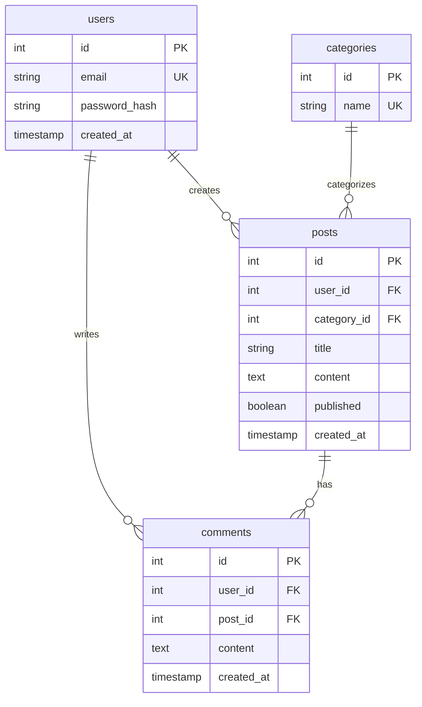

# Update Database - Auto-Generate/Update Database Schema Documentation

Automatically extract database schema and generate/update comprehensive database documentation with ERD diagrams.

$ARGUMENTS (optional: specific table or "all" for full regeneration)

---

## What This Does

Scans your database structure and generates/updates:
- `.claude/database/schema.md` - Complete schema with all tables
- `.claude/database/erd.md` - Entity-Relationship Diagram (Mermaid)
- `.claude/database/migrations.md` - Migration history and strategy
- `.claude/database/queries.md` - Common queries and optimization notes

---

## Usage

```bash
# Generate/update all database docs
/update-database

# Regenerate everything from scratch
/update-database all

# Update specific table documentation
/update-database users
```

---

## Workflow

### Phase 1: Database Detection

1. **Identify Database Type**
   - Check for: PostgreSQL, MySQL, MongoDB, SQLite, etc.
   - Find connection config (env files, config files)
   - Detect ORM: Prisma, TypeORM, Sequelize, SQLAlchemy, GORM, ActiveRecord

2. **Locate Schema Sources**
   - Migration files: `migrations/**/*.{sql,js,ts,py,go,rb}`
   - ORM models: `models/**/*.{js,ts,py,go,rb}`
   - Schema files: `schema.prisma`, `schema.sql`
   - Database connection (if available)

3. **Extract Schema Information**
   - Table names and columns
   - Data types and constraints
   - Primary keys and foreign keys
   - Indexes
   - Relationships (one-to-many, many-to-many)

### Phase 2: Documentation Generation

**Auto-launch `doc-updater` agent:**

```javascript
Task({
  subagent_type: "doc-updater",
  description: "Generate database documentation",
  prompt: `Analyze database structure and generate comprehensive database documentation.

Project: ${project_path}
Database Type: ${db_type}
ORM: ${orm_detected}
Schema Sources: ${schema_sources}

Generate documentation in .claude/database/:

1. **schema.md** - Database Schema
   - Database type and version
   - Connection details (masked)
   - Complete table definitions with columns, types, constraints
   - Indexes for each table
   - Relationships (foreign keys)
   - Table purposes and descriptions
   - Data validation rules
   - Enum types (if any)

2. **erd.md** - Entity-Relationship Diagram
   - Mermaid ERD showing all tables
   - Relationships clearly marked (||--o{, etc.)
   - Cardinality indicators
   - Key constraints shown in table details
   - Grouped by domain/module if applicable

3. **migrations.md** - Migration History
   - Migration tool used (Prisma, Knex, Alembic, etc.)
   - List of all migrations chronologically
   - Migration strategy (up/down, rollback)
   - Schema evolution timeline
   - Breaking changes history
   - Migration best practices for this project

4. **queries.md** - Common Queries
   - Frequently used queries
   - Query optimization notes
   - Index usage explanations
   - Performance considerations
   - Query patterns and anti-patterns

Requirements:
- Use Mermaid ERD syntax
- Include all tables, even utility tables
- Document WHY indexes exist
- Keep each file < 500 lines
- Include SQL examples
- Mark performance-critical paths

Output location: .claude/database/`
})
```

### Phase 3: Verification

1. **Validate Generated Documentation**
   - Check ERD syntax
   - Verify table completeness
   - Ensure relationship accuracy

2. **Report Results**
   ```markdown
   ## Database Documentation Updated

   **Generated:**
   - ✅ .claude/database/schema.md (${table_count} tables)
   - ✅ .claude/database/erd.md (${relationship_count} relationships)
   - ✅ .claude/database/migrations.md (${migration_count} migrations)
   - ✅ .claude/database/queries.md (${query_count} common queries)

   **Database Type:** ${db_type}
   **ORM:** ${orm}
   **Tables:** ${table_list}
   **Indexes:** ${index_count}

   **Next Steps:**
   - Review ERD for correctness
   - Verify relationships match code
   - Add query optimization notes if needed
   ```

---

## What Gets Generated

### schema.md

```markdown
# Database Schema

## Database Type
PostgreSQL 15

## Tables

### users
**Purpose:** User accounts and authentication

| Column | Type | Constraints | Description |
|--------|------|-------------|-------------|
| id | SERIAL | PRIMARY KEY | User ID |
| email | VARCHAR(255) | UNIQUE, NOT NULL | User email |
| password_hash | VARCHAR(255) | NOT NULL | Hashed password |
| created_at | TIMESTAMP | DEFAULT NOW() | Account creation |

**Indexes:**
- `users_email_idx` ON users(email) - Fast email lookup for login

**Relationships:**
- One-to-Many → posts (users.id → posts.user_id)
- One-to-Many → comments (users.id → comments.user_id)

**Validation:**
- Email must be valid format (enforced by application)
- Password must be hashed (bcrypt, 10 rounds)

[More tables...]
```

### erd.md

```markdown
# Entity-Relationship Diagram



## Relationship Details

### users → posts
- **Type:** One-to-Many
- **Foreign Key:** posts.user_id → users.id
- **Cascade:** ON DELETE CASCADE (deleting user deletes their posts)
- **Index:** posts_user_id_idx

[More relationships...]
```

### migrations.md

```markdown
# Migration History

## Migration Tool
Prisma Migrate

## Migration Strategy
- **Up migrations:** Apply schema changes
- **Down migrations:** Rollback changes
- **Testing:** All migrations tested in staging first
- **Deployment:** Migrations run before app deployment

## Migrations

### 20250101_000000_create_users
**Date:** 2025-01-01
**Changes:**
- Created `users` table
- Added email unique index
**Risk:** Low (new table)

### 20250115_000000_add_posts
**Date:** 2025-01-15
**Changes:**
- Created `posts` table
- Added foreign key to users
- Added indexes for user_id and created_at
**Risk:** Low (new table)

[More migrations...]
```

---

## Schema Extraction Methods

### From Migrations (Preferred)
```javascript
// Find migration files
Glob("migrations/**/*.{sql,js,ts,py}")

// Parse SQL/ORM syntax
// Extract table definitions
```

### From ORM Models
```javascript
// Find model files
Glob("models/**/*.{js,ts,py,go,rb}")

// Parse model syntax (Prisma, TypeORM, SQLAlchemy, etc.)
// Extract schema from code
```

### From Live Database (If Available)
```sql
-- PostgreSQL
SELECT table_name, column_name, data_type, is_nullable
FROM information_schema.columns
WHERE table_schema = 'public';

-- MySQL
SHOW TABLES;
DESCRIBE table_name;
```

---

## Auto-Launch Conditions

This command automatically triggers when:
- SessionStart: Database docs missing
- Migration file created/modified
- Schema file changed (schema.prisma, etc.)
- User requests: "Document database"
- Keywords: "DB設計", "スキーマ更新"

---

## Integration

### With `/plan` Command
- Load database schema before planning data features
- Ensure new features work with existing schema

### With `/tdd` Command
- Load schema for data layer tests
- Ensure tests match actual schema

### With CLAUDE.md
```markdown
## Database

See `.claude/database/schema.md` for complete database schema.
Quick: PostgreSQL, ${table_count} tables, Prisma ORM

ERD: `.claude/database/erd.md`
To load: `/database` or read .claude/database/schema.md
```

---

## Success Criteria

✅ `.claude/database/` directory created
✅ All 4 documentation files generated
✅ ERD renders correctly
✅ All tables documented
✅ Relationships accurate
✅ Indexes explained
✅ Migration history captured

---

## Notes

- **Automatic**: `doc-updater` agent runs automatically
- **Visual**: Mermaid ERD for relationships
- **Complete**: All tables, even utility tables
- **Accurate**: Verified against migrations/models
- **Performance-aware**: Index purposes documented
