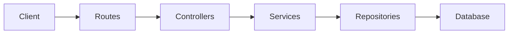
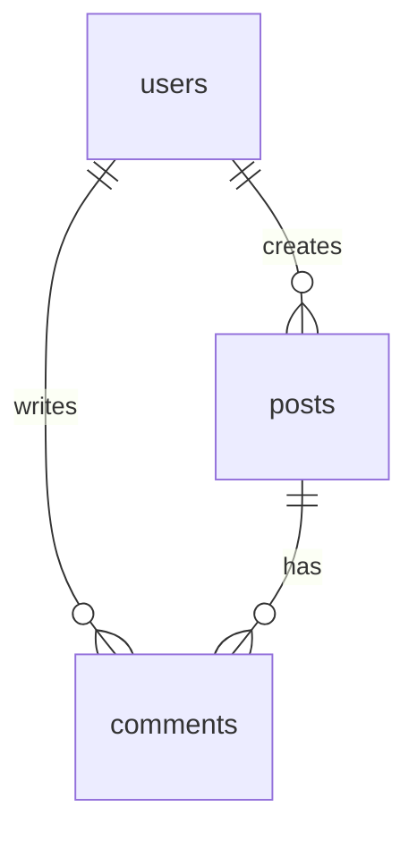

# Automatic Documentation Generation and Maintenance

## Purpose

Automatically generate and maintain project architecture and database documentation to preserve context across sessions and prevent "forgetting" critical project structure.

---

## Core Principle

**Every project should have up-to-date documentation that answers:**
1. **What is the architecture?** (components, layers, patterns)
2. **How is the database designed?** (schema, relationships, indexes)
3. **Where are things located?** (folder structure, key files)
4. **What are the key decisions?** (why this approach, trade-offs)

---

## Standard Documentation Structure

**Every project MUST have:**

```
.claude/
├── architecture/
│   ├── overview.md          # System architecture overview
│   ├── components.md        # Major components and their responsibilities
│   ├── data-flow.md         # How data flows through the system
│   └── decisions.md         # Architectural decision records (ADRs)
├── database/
│   ├── schema.md            # Database schema with table definitions
│   ├── erd.md               # Entity-relationship diagram (Mermaid)
│   ├── migrations.md        # Migration history and strategy
│   └── queries.md           # Common queries and optimization notes
├── api/                     # (if applicable)
│   ├── endpoints.md         # API endpoints list
│   └── contracts.md         # Request/response contracts
└── context/
    ├── session-state.json   # Current session state (auto-managed)
    └── current-task.md      # Current work context
```

---

## Automatic Generation Triggers

### When to Auto-Generate (SessionStart)

**If documentation structure is missing:**
- Check for `.claude/architecture/`, `.claude/database/`, `.claude/context/`
- If missing, **automatically propose creation**
- Ask user: "Project documentation is missing. Would you like me to analyze the codebase and generate architecture + database docs?"

**User response:**
- ✅ Yes → Launch documentation generation immediately
- 📝 Partial → Ask which sections to generate
- ❌ No → Skip but remind at next SessionStart

### When to Auto-Update (During Session)

**Trigger conditions:**
1. **Large code changes** (3+ files modified, 100+ lines changed)
2. **Database migration created** (new migration file detected)
3. **New API endpoints added** (route files modified)
4. **Architecture change detected** (new directories, major refactoring)
5. **User explicitly requests** (`/update-architecture`, `/update-database`)

**Auto-update workflow:**
1. Detect trigger condition
2. Notify user: "🔄 Architecture/DB changes detected. Update documentation?"
3. If user approves → Launch `doc-updater` agent to update relevant docs
4. If user declines → Skip but track (suggest again in 5+ changes)

### When to Auto-Review (SessionEnd)

**Before session ends:**
1. Check if major changes were made
2. If documentation is outdated, prompt: "📖 Documentation may be outdated. Update before ending session?"
3. User can approve/defer/skip

---

## Documentation Generation Process

### Architecture Documentation

**Process:**
1. **Scan project structure** (use Glob, ls, find)
2. **Identify language/framework** (package.json, requirements.txt, go.mod, etc.)
3. **Detect architecture pattern** (MVC, Clean Architecture, Layered, Microservices, etc.)
4. **Extract components** (controllers, services, models, middleware, etc.)
5. **Analyze data flow** (request → controller → service → database → response)
6. **Generate documentation** with Mermaid diagrams

**Output: `.claude/architecture/overview.md`**
```markdown
# Architecture Overview

## Type
[MVC / Clean Architecture / Microservices / etc.]

## Layers
- **Presentation Layer**: [controllers, routes]
- **Business Logic Layer**: [services, use cases]
- **Data Access Layer**: [repositories, models]
- **Infrastructure**: [database, external APIs]

## Key Components
[Component list with responsibilities]

## Data Flow


## Folder Structure
[Directory tree with explanations]

## Design Patterns
[Patterns used: Repository, Factory, Strategy, etc.]

## Key Decisions
[Why this architecture, trade-offs, constraints]
```

### Database Documentation

**Process:**
1. **Detect database type** (PostgreSQL, MySQL, MongoDB, etc.)
2. **Extract schema** (from migrations, models, or direct DB connection)
3. **Identify relationships** (foreign keys, references)
4. **Analyze indexes** (performance optimization)
5. **Generate ERD** (Mermaid diagram)

**Output: `.claude/database/schema.md`**
```markdown
# Database Schema

## Database Type
[PostgreSQL / MySQL / MongoDB / etc.]

## Tables

### users
| Column | Type | Constraints | Description |
|--------|------|-------------|-------------|
| id | SERIAL | PRIMARY KEY | User ID |
| email | VARCHAR(255) | UNIQUE, NOT NULL | User email |
| created_at | TIMESTAMP | DEFAULT NOW() | Creation time |

### posts
[...]

## Relationships


## Indexes
- `users_email_idx` ON users(email) - Fast email lookup
- `posts_user_id_idx` ON posts(user_id) - User posts query

## Common Queries
[Frequently used queries with optimization notes]
```

---

## Agent Responsibilities

### `doc-updater` Agent

**Primary responsibility:**
- Generate and maintain `.claude/architecture/` and `.claude/database/` documentation

**When to launch:**
- Project documentation missing (SessionStart)
- Major code/schema changes detected (during session)
- User requests update (`/update-architecture`, `/update-database`)
- Session ending with outdated docs (SessionEnd)

**Launch pattern:**
```javascript
Task({
  subagent_type: "doc-updater",
  description: "Generate/update architecture documentation",
  prompt: `Analyze project structure and generate comprehensive architecture documentation.

Project path: ${project_path}
Language/Framework: ${detected_stack}
Existing docs: ${existing_docs}

Generate:
1. .claude/architecture/overview.md - System architecture with Mermaid diagrams
2. .claude/architecture/components.md - Component responsibilities
3. .claude/architecture/data-flow.md - Data flow diagrams

Include:
- Architecture pattern (MVC, Clean, etc.)
- Layer descriptions
- Component relationships
- Folder structure explanation
- Key architectural decisions

Use Mermaid for all diagrams.`
})
```

### `general-purpose` Agent (for deep analysis)

**When architecture is complex:**
- Use `general-purpose` agent to deeply analyze codebase
- Then `doc-updater` to synthesize findings into documentation

---

## Automation Hooks

### SessionStart Hook

**Check for documentation:**
```javascript
// Pseudo-code
if (!exists('.claude/architecture/') || !exists('.claude/database/')) {
  console.error('[Auto-Doc] Project documentation missing')
  console.error('[Auto-Doc] Run /update-architecture to generate')

  // Optionally: Auto-prompt user
  // "Generate project documentation now? (Y/n)"
}
```

### PostToolUse Hook (Edit/Write)

**Detect significant changes:**
```javascript
// Track file modifications
let modificationCount = 0
let databaseFileChanged = false

if (tool === 'Edit' || tool === 'Write') {
  modificationCount++

  if (file_path.includes('migration') || file_path.includes('schema')) {
    databaseFileChanged = true
  }

  // After 5+ modifications or DB change
  if (modificationCount >= 5 || databaseFileChanged) {
    console.error('[Auto-Doc] Consider updating documentation: /update-architecture')
    modificationCount = 0 // Reset counter
  }
}
```

### SessionEnd Hook

**Check documentation freshness:**
```javascript
// If significant work was done
if (files_modified >= 3) {
  const archDocAge = getFileAge('.claude/architecture/overview.md')

  if (archDocAge > 7 days || architectureChanged) {
    console.error('[Auto-Doc] Documentation may be outdated')
    console.error('[Auto-Doc] Run /update-architecture before next session')
  }
}
```

---

## Slash Commands

### `/update-architecture`

**Purpose:** Generate/update architecture documentation

**Workflow:**
1. Analyze project structure
2. Detect architecture pattern
3. Generate Mermaid diagrams
4. Write to `.claude/architecture/`

**Launch `doc-updater` agent automatically**

### `/update-database`

**Purpose:** Generate/update database schema documentation

**Workflow:**
1. Detect database type
2. Extract schema (migrations, models, or DB connection)
3. Generate ERD (Mermaid)
4. Write to `.claude/database/`

**Launch `doc-updater` agent automatically**

### `/update-docs` (Combined)

**Purpose:** Update all project documentation

**Workflow:**
1. Launch `/update-architecture`
2. Launch `/update-database`
3. Launch `/update-codemaps` (if available)

**Parallel agent execution for speed**

---

## Documentation Quality Standards

### Good Documentation

✅ **Concise** - < 500 lines per file
✅ **Visual** - Mermaid diagrams for architecture, ERD, data flow
✅ **Accurate** - Matches actual codebase (verified)
✅ **Structured** - Clear sections, headers, tables
✅ **Current** - Updated within last 30 days

### Poor Documentation

❌ Too verbose (> 1000 lines)
❌ No diagrams (text-only)
❌ Outdated (doesn't match code)
❌ Unstructured (wall of text)
❌ Stale (> 90 days old)

---

## Context Window Optimization

**Problem:** Documentation can consume context tokens

**Solution: Lazy Loading**
- Don't auto-load all documentation at SessionStart
- Load only when needed:
  - `/architecture` → Load architecture docs
  - `/database` → Load database docs
  - Specific file work → Load relevant section only

**CLAUDE.md should only contain:**
- Path to documentation (`.claude/architecture/overview.md`)
- Brief 1-2 line summary
- Instruction to load when needed

**Example CLAUDE.md entry:**
```markdown
## Architecture

See `.claude/architecture/overview.md` for full system architecture.
Quick summary: [MVC pattern, Express + PostgreSQL, RESTful API]

To load full architecture: Run `/architecture` command
```

---

## Integration with Existing Commands

### `/plan` Command

**Before planning:**
1. Check if architecture docs exist
2. If yes, load them for context
3. If no, offer to generate: "Generate architecture docs first for better planning?"

### `/tdd` Command

**Before writing tests:**
1. Load database schema (if testing data layer)
2. Load API contracts (if testing endpoints)
3. Ensure test structure aligns with architecture

### `/document` Command

**When generating docs:**
1. First update `.claude/architecture/` and `.claude/database/`
2. Then generate user-facing documentation (README, API docs)
3. Ensure consistency between internal and external docs

---

## Best Practices

### 1. Generate Early

**On project start:**
- Run `/update-architecture` immediately
- Run `/update-database` if database exists
- Establish documentation baseline

### 2. Update Regularly

**After major changes:**
- New feature → Update architecture
- Schema migration → Update database docs
- Refactoring → Update components/data-flow

### 3. Keep Lean

**Avoid bloat:**
- Remove outdated sections
- Consolidate duplicate information
- Use links instead of copying content

### 4. Use Mermaid Diagrams

**Visual > Text:**
- Architecture diagrams
- ERD diagrams
- Sequence diagrams for complex flows
- Flowcharts for business logic

### 5. Version Control

**Track changes:**
- Commit documentation with code changes
- Review documentation in PRs
- Keep docs in sync with code

---

## Success Metrics

**Documentation system is working when:**
- ✅ Every project has `.claude/architecture/` and `.claude/database/`
- ✅ Documentation is updated within 7 days of major changes
- ✅ Context is preserved across sessions (no "forgetting")
- ✅ New team members can understand architecture from docs
- ✅ Docs are referenced in code reviews and planning

---

## Future Enhancements

### Phase 2
- **Auto-detection of outdated docs** (compare code vs docs age)
- **Diff-based updates** (only update changed sections)
- **Multi-project knowledge graph** (link related projects)

### Phase 3
- **AI-driven architecture suggestions** (based on best practices)
- **Automatic ADR generation** (capture decisions automatically)
- **Cross-project pattern detection** (reuse architectures)

---

## Notes

- **Balance automation with control**: Propose updates, don't force them
- **Respect user preference**: Some users want manual control
- **Optimize for context**: Lazy load documentation, don't bloat CLAUDE.md
- **Quality over quantity**: Better to have accurate 100 lines than inaccurate 1000 lines
