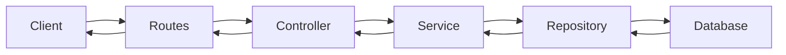
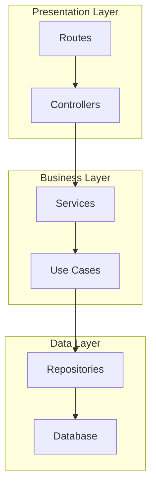
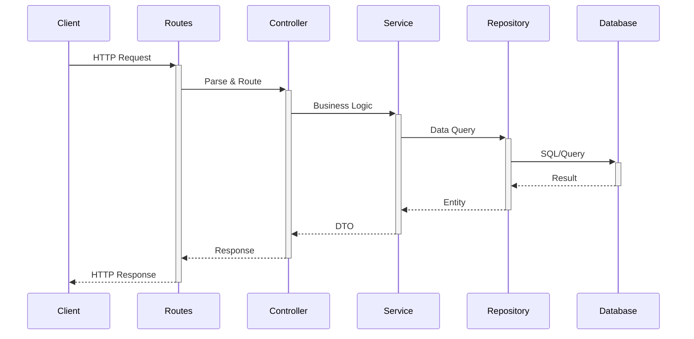
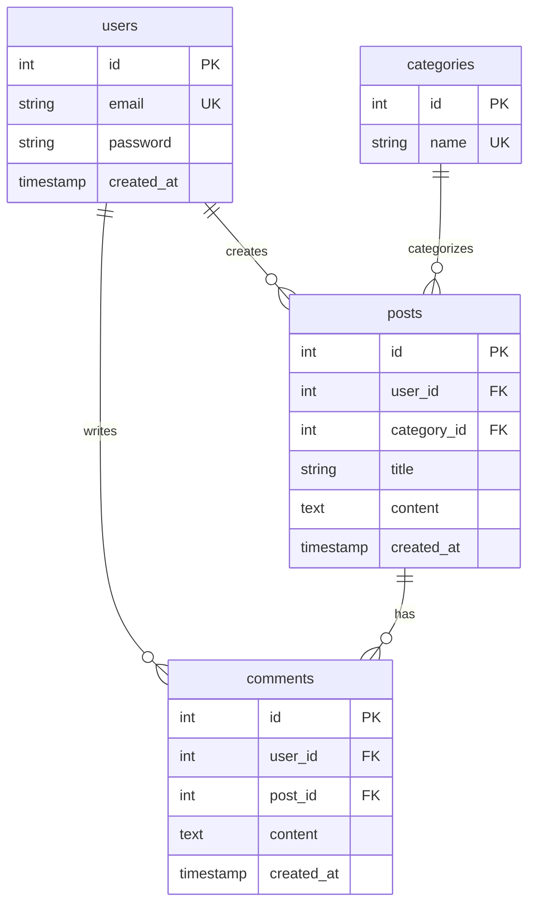
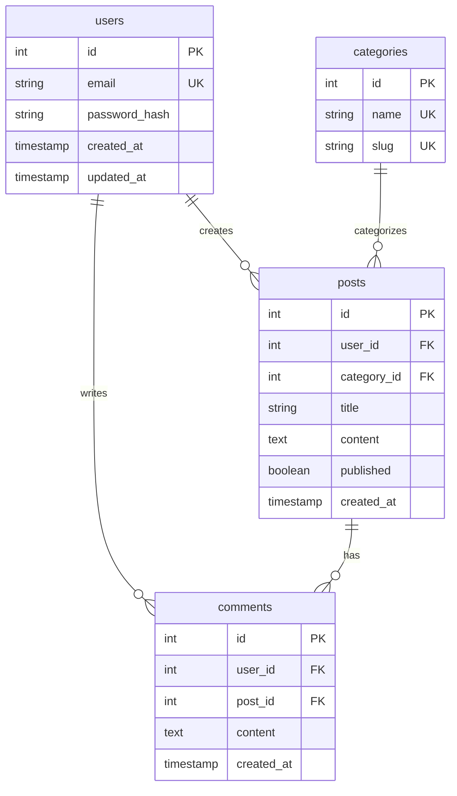

# Auto Architecture Documentation Skill

**Skill Name**: Automatic Architecture Documentation
**Purpose**: Automatically generate and maintain project architecture and database documentation
**Complexity**: Advanced
**Impact**: High (preserves context, prevents "forgetting" project structure)

---

## Core Concept

**Problem:** During coding sessions, you lose context about:
- Overall system architecture
- Database schema and relationships
- Component responsibilities
- Data flow patterns
- Architectural decisions

**Solution:** Automatically generate and maintain structured documentation that answers:
1. **What** is the architecture? (layers, patterns, components)
2. **How** does data flow? (request → response journey)
3. **Where** are things located? (folder structure, key files)
4. **Why** these decisions? (trade-offs, constraints)

---

## When to Use This Skill

### Trigger Conditions

1. **Project Initialization** (SessionStart)
   - `.claude/architecture/` doesn't exist
   - `.claude/database/` doesn't exist
   - → Offer to generate documentation

2. **During Development**
   - 5+ files modified in session
   - Database migration created
   - Major refactoring completed
   - New components added
   - → Suggest documentation update

3. **Session Ending** (SessionEnd)
   - Significant changes made
   - Documentation > 7 days old
   - → Prompt to update before closing

4. **Explicit Request**
   - User runs `/update-architecture`
   - User runs `/update-database`
   - User runs `/update-docs`

---

## Documentation Structure

### Standard Project Layout

```
.claude/
├── architecture/
│   ├── overview.md          # System architecture overview
│   ├── components.md        # Component catalog
│   ├── data-flow.md         # Data flow diagrams
│   └── decisions.md         # Architectural Decision Records
├── database/
│   ├── schema.md            # Database schema
│   ├── erd.md               # Entity-Relationship Diagram
│   ├── migrations.md        # Migration history
│   └── queries.md           # Common queries
├── api/                     # (if applicable)
│   ├── endpoints.md         # API endpoint list
│   └── contracts.md         # Request/response schemas
└── context/
    ├── session-state.json   # Current session (auto-managed)
    └── current-task.md      # Work context
```

---

## Architecture Documentation Generation

### Step 1: Project Analysis

**Scan project structure:**
```javascript
// Use Glob to find key directories
Glob("**/")                    // All directories
Glob("**/*.{js,ts,py,go,rb}")  // Code files
Glob("**/package.json")        // Dependency manifests
Glob("**/migrations/**/*")     // Database migrations
```

**Identify:**
- **Language/Framework**: package.json, requirements.txt, go.mod, Gemfile
- **Architecture Pattern**: MVC, Clean Architecture, Layered, Microservices
- **Components**: controllers, services, models, middleware, repositories
- **Infrastructure**: database, caching, message queue, external APIs

### Step 2: Component Extraction

**By architecture pattern:**

**MVC (Model-View-Controller):**
```
- Controllers: Handle HTTP requests (routes, controllers/)
- Models: Data and business logic (models/)
- Views: Templates/UI (views/, components/)
```

**Clean Architecture:**
```
- Presentation: Controllers, DTOs (presentation/)
- Application: Use cases, business logic (application/)
- Domain: Entities, domain services (domain/)
- Infrastructure: Repositories, external services (infrastructure/)
```

**Layered Architecture:**
```
- API Layer: Routes, controllers
- Service Layer: Business logic
- Data Layer: Repositories, database
- Infrastructure: External integrations
```

### Step 3: Data Flow Analysis

**Trace request journey:**
```
1. Entry point: HTTP request → routes
2. Controller: Parse request, call service
3. Service: Business logic, call repository
4. Repository: Database query
5. Response: Transform data, return to client
```

**Generate Mermaid diagram:**


### Step 4: Architecture Documentation Output

**File: `.claude/architecture/overview.md`**

```markdown
# Architecture Overview

## Architecture Pattern
[MVC / Clean Architecture / Layered / Microservices]

## System Diagram


## Layers

### Presentation Layer
- **Responsibility**: Handle HTTP requests/responses
- **Components**: Routes, Controllers, Middleware
- **Location**: `src/routes/`, `src/controllers/`, `src/middleware/`

### Business Layer
- **Responsibility**: Business logic and use cases
- **Components**: Services, Validators, Transformers
- **Location**: `src/services/`, `src/validators/`

### Data Layer
- **Responsibility**: Data access and persistence
- **Components**: Repositories, Models, ORM
- **Location**: `src/repositories/`, `src/models/`

## Key Components

### Controllers
| Component | Responsibility | Location |
|-----------|----------------|----------|
| UserController | User management | src/controllers/user.ts |
| AuthController | Authentication | src/controllers/auth.ts |

### Services
| Service | Responsibility | Location |
|---------|----------------|----------|
| UserService | User business logic | src/services/user.ts |
| AuthService | Authentication logic | src/services/auth.ts |

## Data Flow

### Request Flow


## Folder Structure
```
src/
├── routes/       # API route definitions
├── controllers/  # Request handlers
├── services/     # Business logic
├── repositories/ # Data access
├── models/       # Data models
├── middleware/   # Cross-cutting concerns
└── utils/        # Shared utilities
```

## Design Patterns Used
- **Repository Pattern**: Abstract data access
- **Service Pattern**: Encapsulate business logic
- **Dependency Injection**: Loose coupling
- **Factory Pattern**: Object creation

## Architectural Decisions

### Why MVC?
- Simple, well-understood pattern
- Clear separation of concerns
- Easy to test and maintain

### Why this folder structure?
- Groups by technical layer (not feature)
- Easy to navigate for new developers
- Consistent across projects

## Technology Stack
- **Runtime**: Node.js 18+
- **Framework**: Express.js
- **Database**: PostgreSQL
- **ORM**: Prisma
- **API Style**: RESTful
```

---

## Database Documentation Generation

### Step 1: Schema Extraction

**From migrations:**
```javascript
// Find migration files
Glob("**/migrations/**/*.{sql,js,ts,py}")
Read("migrations/001_create_users.sql")

// Extract table definitions
```

**From ORM models:**
```javascript
// Find model files
Glob("**/models/**/*.{js,ts,py}")
Read("models/User.ts")

// Extract schema from code
```

### Step 2: Relationship Detection

**Analyze:**
- Foreign keys
- One-to-many relationships
- Many-to-many relationships (join tables)
- Indexes

### Step 3: ERD Generation

**Mermaid ERD:**


### Step 4: Database Documentation Output

**File: `.claude/database/schema.md`**

```markdown
# Database Schema

## Database Type
PostgreSQL 15

## Connection
- Host: localhost
- Database: myapp_production
- Schema: public

## Tables

### users
**Description**: User accounts and authentication

| Column | Type | Constraints | Description |
|--------|------|-------------|-------------|
| id | SERIAL | PRIMARY KEY | User ID |
| email | VARCHAR(255) | UNIQUE, NOT NULL | User email |
| password_hash | VARCHAR(255) | NOT NULL | Hashed password |
| created_at | TIMESTAMP | DEFAULT NOW() | Account creation time |
| updated_at | TIMESTAMP | DEFAULT NOW() | Last update time |

**Indexes:**
- `users_email_idx` ON users(email) - Fast email lookup for login

**Relationships:**
- One user has many posts (users.id → posts.user_id)
- One user has many comments (users.id → comments.user_id)

### posts
**Description**: Blog posts created by users

| Column | Type | Constraints | Description |
|--------|------|-------------|-------------|
| id | SERIAL | PRIMARY KEY | Post ID |
| user_id | INTEGER | FOREIGN KEY → users(id) | Post author |
| category_id | INTEGER | FOREIGN KEY → categories(id) | Post category |
| title | VARCHAR(500) | NOT NULL | Post title |
| content | TEXT | NOT NULL | Post content |
| published | BOOLEAN | DEFAULT FALSE | Published status |
| created_at | TIMESTAMP | DEFAULT NOW() | Creation time |

**Indexes:**
- `posts_user_id_idx` ON posts(user_id) - User posts query
- `posts_category_id_idx` ON posts(category_id) - Category posts query
- `posts_published_created_idx` ON posts(published, created_at) - Recent published posts

**Relationships:**
- One post belongs to one user (posts.user_id → users.id)
- One post belongs to one category (posts.category_id → categories.id)
- One post has many comments (posts.id → comments.post_id)

## Entity Relationship Diagram



## Common Queries

### Get user with posts
```sql
SELECT u.*,
       json_agg(p.*) AS posts
FROM users u
LEFT JOIN posts p ON p.user_id = u.id
WHERE u.id = $1
GROUP BY u.id;
```

### Get recent published posts
```sql
SELECT p.*, u.email AS author_email, c.name AS category_name
FROM posts p
JOIN users u ON u.id = p.user_id
JOIN categories c ON c.id = p.category_id
WHERE p.published = TRUE
ORDER BY p.created_at DESC
LIMIT 20;
```

## Migration Strategy
- **Tool**: Prisma Migrate / Knex / Alembic
- **Versioning**: Sequential numbered migrations
- **Rollback**: Every migration has down/rollback script
- **Testing**: Migrations tested in staging before production

## Performance Considerations
- Index on foreign keys for JOIN performance
- Composite index on (published, created_at) for recent posts query
- EXPLAIN ANALYZE used to verify query plans
```

---

## Implementation Workflow

### Automatic Generation (SessionStart)

```javascript
// 1. Check if documentation exists
if (!exists('.claude/architecture/overview.md')) {
  // 2. Notify user
  console.error('[Auto-Doc] Project architecture documentation missing')
  console.error('[Auto-Doc] Generate now? This helps preserve context across sessions.')

  // 3. If user approves, launch doc-updater agent
  Task({
    subagent_type: "doc-updater",
    description: "Generate architecture documentation",
    prompt: `Analyze project and generate architecture documentation...`
  })
}
```

### Update During Session (PostToolUse)

```javascript
// Track modifications
let fileModCount = 0
let dbFilesModified = []

if (tool === 'Edit' || tool === 'Write') {
  fileModCount++

  if (file_path.includes('migration') || file_path.includes('schema')) {
    dbFilesModified.push(file_path)
  }

  // Suggest update after 5+ mods or DB change
  if (fileModCount >= 5 || dbFilesModified.length > 0) {
    console.error('[Auto-Doc] Consider updating documentation:')
    if (fileModCount >= 5) {
      console.error('  /update-architecture (architecture may have changed)')
    }
    if (dbFilesModified.length > 0) {
      console.error('  /update-database (schema changed)')
    }
  }
}
```

---

## Best Practices

### 1. Generate Early
- Create docs on project initialization
- Establish baseline before heavy development

### 2. Update Frequently
- After major refactoring
- After adding new components
- After schema migrations
- Weekly for active projects

### 3. Keep Visual
- Use Mermaid diagrams liberally
- Diagrams > text for architecture
- ERD for database relationships
- Sequence diagrams for complex flows

### 4. Stay Concise
- Each file < 500 lines
- Focus on high-level concepts
- Link to code for details
- Avoid redundancy

### 5. Version Control
- Commit docs with code changes
- Review docs in PRs
- Treat docs as first-class code

---

## Success Metrics

**Documentation is working when:**
- ✅ No context loss between sessions
- ✅ New developers understand system in < 1 hour
- ✅ Architecture questions answered by docs
- ✅ Database queries optimized based on schema docs
- ✅ Docs referenced in code reviews

---

## Integration with Other Skills

### With `/plan` Command
- Load architecture docs before planning
- Ensure new features align with existing architecture
- Update architecture docs after planning

### With `/tdd` Command
- Load database schema for data layer tests
- Load API contracts for integration tests
- Update docs with new test patterns

### With `/document` Command
- Architecture docs inform user-facing docs
- Consistent terminology across all docs
- Cross-reference internal and external docs

---

## Maintenance

**Quarterly Review:**
- Verify docs match reality
- Remove outdated sections
- Consolidate redundant information
- Improve diagram clarity

**Continuous Improvement:**
- Track which docs are most useful
- Add missing sections based on feedback
- Refine generation prompts
- Optimize for context window efficiency
