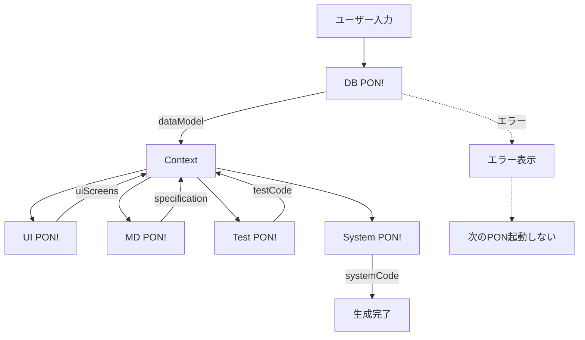

# PON Connection Architecture

このスキルは、PON!プラットフォームにおける各PONモジュール間の接続アーキテクチャを定義します。

## 概要

PON!は以下のモジュールで構成されます：
- **DB PON!**: データモデル設計
- **UI PON!**: UI画面生成
- **MD PON!**: 仕様書生成
- **Test PON!**: テストコード生成
- **System PON!**: 本番コード統合

これらのモジュールは**完全自動**のデータフローで接続されます。

## アーキテクチャ原則

### 1. データ管理方式

**採用: Context API（グローバル状態管理）**

```javascript
// contexts/PonDataContext.jsx
const PonDataContext = createContext();

export const PonDataProvider = ({ children }) => {
  const [ponData, setPonData] = useState({
    dataModel: null,      // DB PON!の出力
    uiScreens: [],        // UI PON!の出力
    specification: null,  // MD PON!の出力
    testCode: null,       // Test PON!の出力
    systemCode: null      // System PON!の出力
  });

  return (
    <PonDataContext.Provider value={{ ponData, setPonData }}>
      {children}
    </PonDataContext.Provider>
  );
};
```

**理由**:
- ✅ 全PONからアクセス可能
- ✅ データの一元管理
- ✅ 自動伝播が容易
- ✅ LocalStorageとの併用可能（永続化）

### 2. データフロー方式

**採用: 完全自動フロー**

```
DB PON!でデータモデル生成完了
  ↓ 自動的に
UI PON!が起動して画面生成開始
  ↓ 自動的に
MD PON!が仕様書生成開始
  ↓ 自動的に
Test PON!がテスト生成開始
  ↓ 自動的に
System PON!が本番コード生成開始
```

**実装パターン**:
```javascript
// UI PON! の例
useEffect(() => {
  if (ponData.dataModel && !ponData.uiScreens.length) {
    // データモデルが利用可能 & UI画面未生成
    // → 自動的に画面生成開始
    generateScreens(ponData.dataModel);
  }
}, [ponData.dataModel]);
```

### 3. データ形式の統一

**採用: PON共通データ形式**

```javascript
// types/PonDataTypes.js

/**
 * 全PONが出力するデータの共通フォーマット
 */
export const createPonOutput = (ponType, data) => ({
  meta: {
    ponType: ponType,        // 'DB_PON' | 'UI_PON' | 'MD_PON' | 'TEST_PON' | 'SYSTEM_PON'
    version: '1.0.0',
    generatedAt: new Date().toISOString(),
    projectId: getCurrentProjectId(),
  },
  data: data
});

/**
 * DB PON!の出力形式
 */
export const DBPonOutput = {
  meta: { ponType: 'DB_PON', ... },
  data: {
    tables: [
      {
        id: string,
        name: string,
        displayName: string,
        columns: [...],
        indexes: [...]
      }
    ],
    relations: [
      {
        id: string,
        fromTable: string,
        toTable: string,
        type: '1:1' | '1:N' | 'N:N',
        foreignKey: string
      }
    ]
  }
};

/**
 * UI PON!の出力形式
 */
export const UIPonOutput = {
  meta: { ponType: 'UI_PON', ... },
  data: {
    screens: [
      {
        id: string,
        name: string,
        type: 'list' | 'detail' | 'form',
        dataSource: string,  // テーブル名
        reactCode: string,
        components: [...]
      }
    ]
  }
};

/**
 * MD PON!の出力形式
 */
export const MDPonOutput = {
  meta: { ponType: 'MD_PON', ... },
  data: {
    markdown: string,  // 生成された仕様書（Markdown形式）
    sections: {
      overview: string,
      screens: string,
      dataModel: string,
      apiSpec: string
    }
  }
};

/**
 * Test PON!の出力形式
 */
export const TestPonOutput = {
  meta: { ponType: 'TEST_PON', ... },
  data: {
    unitTests: string,      // Jestテストコード
    integrationTests: string, // Playwrightテストコード
    testCases: [
      {
        id: string,
        type: 'unit' | 'integration',
        target: string,
        description: string
      }
    ]
  }
};

/**
 * System PON!の出力形式
 */
export const SystemPonOutput = {
  meta: { ponType: 'SYSTEM_PON', ... },
  data: {
    files: [
      {
        path: string,
        content: string,
        type: 'component' | 'service' | 'schema' | 'config'
      }
    ],
    structure: {
      frontend: [...],
      backend: [...],
      tests: [...]
    }
  }
};
```

### 4. エラーハンドリング

**採用: 次のPONを起動させない**

```javascript
// 各PONの実装パターン
const UIPon = () => {
  const { ponData } = usePonData();

  // データモデルが存在しない場合
  if (!ponData.dataModel) {
    return (
      <Message
        severity="warn"
        text="DB PON!でデータモデルを生成してください"
      />
    );
  }

  // エラーがある場合
  if (ponData.dataModel.meta.error) {
    return (
      <Message
        severity="error"
        text={`DB PON!でエラーが発生しました: ${ponData.dataModel.meta.error}`}
      />
    );
  }

  // 正常時のみ処理を継続
  return <div>...</div>;
};
```

**エラー情報の付与**:
```javascript
// エラーが発生した場合
const errorOutput = createPonOutput('DB_PON', {
  tables: [],
  relations: []
});
errorOutput.meta.error = 'LLM APIが応答しませんでした';
errorOutput.meta.success = false;

setPonData({ ...ponData, dataModel: errorOutput });
```

### 5. Claude Codeによる自動実装

**目的**: SKILLを読んで、Claude Codeが接続コードを自動生成できる

**実装手順**:

1. **Context設定**
```javascript
// App.jsx のルートに追加
import { PonDataProvider } from './contexts/PonDataContext';

const App = () => (
  <PonDataProvider>
    <TabView>
      <TabPanel header="DB PON"><DBPon /></TabPanel>
      <TabPanel header="UI PON"><UIPon /></TabPanel>
      <TabPanel header="MD PON"><MDPon /></TabPanel>
      <TabPanel header="Test PON"><TestPon /></TabPanel>
      <TabPanel header="System PON"><SystemPon /></TabPanel>
    </TabView>
  </PonDataProvider>
);
```

2. **各PONでContext使用**
```javascript
// DB PON!の例
import { usePonData } from '../contexts/PonDataContext';
import { createPonOutput } from '../types/PonDataTypes';

const DBPon = () => {
  const { ponData, setPonData } = usePonData();

  const handleGenerate = async (input) => {
    const dataModel = await generateDataModel(input);

    const output = createPonOutput('DB_PON', {
      tables: dataModel.tables,
      relations: dataModel.relations
    });

    setPonData({ ...ponData, dataModel: output });
  };

  return <div>...</div>;
};
```

3. **自動トリガー実装**
```javascript
// UI PON!の例
const UIPon = () => {
  const { ponData, setPonData } = usePonData();
  const [generated, setGenerated] = useState(false);

  useEffect(() => {
    if (ponData.dataModel && !generated && !ponData.uiScreens.length) {
      // 自動生成開始
      generateScreens(ponData.dataModel).then(screens => {
        const output = createPonOutput('UI_PON', { screens });
        setPonData({ ...ponData, uiScreens: output });
        setGenerated(true);
      });
    }
  }, [ponData.dataModel, generated]);

  return <div>...</div>;
};
```

## 接続フロー図



## データ永続化

Context APIは揮発性のため、LocalStorageと併用:

```javascript
// contexts/PonDataContext.jsx
const PonDataProvider = ({ children }) => {
  const [ponData, setPonData] = useState(() => {
    // 起動時にLocalStorageから復元
    const saved = localStorage.getItem('pon-data');
    return saved ? JSON.parse(saved) : initialState;
  });

  useEffect(() => {
    // データ変更時にLocalStorageに保存
    localStorage.setItem('pon-data', JSON.stringify(ponData));
  }, [ponData]);

  return <PonDataContext.Provider value={{ ponData, setPonData }}>
    {children}
  </PonDataContext.Provider>;
};
```

## チェックリスト

新しいPONを追加する時、以下を確認:

- [ ] `PonDataTypes.js`に出力形式を定義
- [ ] `createPonOutput()`でデータをラップ
- [ ] `usePonData()`でContextにアクセス
- [ ] 前のPONのデータが存在しない場合のエラーハンドリング
- [ ] `useEffect`で前のPONのデータを監視して自動生成
- [ ] 生成完了時に`setPonData()`で結果を保存

## 参照ファイル

- `src/contexts/PonDataContext.jsx` - Context定義
- `src/types/PonDataTypes.js` - データ型定義
- `src/components/App.jsx` - ルート設定
- 各PONの実装: `src/{pon-name}/src/components/`
